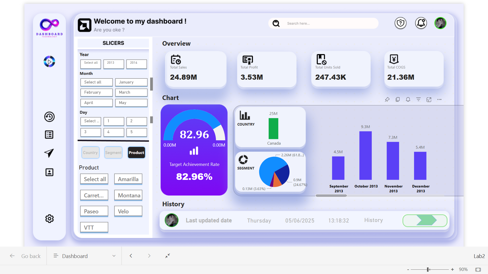

# 📊 Sales Performance Dashboard with Power BI

This Power BI project delivers a sleek and interactive dashboard for visualizing sales performance data across regions, products, and time periods. It features dynamic slicers, auto-refresh with Power Automate, a modern interface designed in Figma, and real-time refresh timestamps.

---


## 🔍 Overview

The dashboard provides detailed insights into:

- **Sales** and **Profit** by region, product, and segment  
- **Monthly** and **Yearly** trends  
- Interactive views for **Gross Sales**, **Discounts**, **COGS**, and more  
- Filtering via slicers: `Segment`, `Country`, `Product`, `Discount Band`, and `Date`

---

## 🎨 User Interface

- UI/UX is **designed in Figma** and imported into Power BI as **high-resolution PNGs**.
- The layout emphasizes clarity, clean visuals, and easy navigation.

---

## 🧠 Key Features

### ✅ Slicers & Bookmarks
- Multiple slicers allow real-time filtering across dimensions.
- Bookmarks enable toggling between custom analytical views.

### 🔄 Auto Refresh with Power Automate
- Data refreshes automatically via **Power Automate** and **Power BI Service**.
- This ensures the dashboard always presents the latest information.
- Refresh time is saved and displayed.

---

## 🕒 Display Last Refresh Date

### Method 1: Add Date Column in Power Query

```bash
= Table.AddColumn(PreviousStepName, "Last Refresh Date", each DateTime.LocalNow(), type datetime)
```
=> Adds a column to your data with the last refresh time. This value updates on every refresh.

### Method 2: Create a Separate Refresh Time Query
```bash
let
    Source = #table({"Last Refresh Date"}, {{DateTime.LocalNow()}})
in
    Source
```
=> This generates a one-row table that stores the current timestamp.

### Method 3: Create a DAX Measure

```bash
LastRefresh = MAX('YourTableName'[Last Refresh Date])
```
Or display the system time when the report loads:

```bash
LastRefresh = NOW()
```

### Method 4: Display in Report
Use a Card visual or Text Box to show the LastRefresh value on the dashboard for transparency.


### ⏰ Schedule Dataset Refresh
Steps in Power BI Service:
Publish your report to the Service.
Go to Datasets → Settings.
Under Scheduled Refresh, set your desired frequency (daily, hourly, etc.).
Ensure your data gateway and credentials are properly configured.


### 📁 Dataset Description

| **Column**             | **Description**                       |
|------------------------|----------------------------------------|
| `Segment`              | Market segment (e.g., Government)      |
| `Country`              | Country of sale                        |
| `Product`              | Product name                           |
| `Discount Band`        | Discount category                      |
| `Units Sold`           | Number of items sold                   |
| `Manufacturing Price`  | Unit cost                              |
| `Sale Price`           | Unit sale price                        |
| `Gross Sales`          | Units Sold × Sale Price                |
| `Discounts`            | Total discount value                   |
| `Sales`                | Gross Sales - Discounts                |
| `COGS`                 | Cost of Goods Sold                     |
| `Profit`               | Sales - COGS                           |
| `Date`                 | Transaction date                       |
| `Month Number`         | Month (numeric)                        |
| `Month Name`           | Month name (text)                      |
| `Year`                 | Year of transaction                    |


### 🛠 Tech Stack
- Power BI Desktop & Service
- Power Automate
- Figma (UI/UX Design)


### 🔗 Useful Links

- 📈 **Power BI Report**: 
[View on Power BI Server](https://app.powerbi.com/links/d_8xWDbcsV?ctid=038da1a0-e109-4ca0-bc72-2641c98bb47f&pbi_source=linkShare&bookmarkGuid=985ea566-b099-45c9-aee2-8c6e27cd0ea3&portalSessionId=4443954a-b780-4a7a-b6e7-d729dfa7e009&fromEntryPoint=share)  
- 🎨 **Figma Design**: 
[View UI Design on Figma](https://www.figma.com/design/sNVrru5c3DXVjVnI3jtdgG/Build-PowerBi-Template?node-id=0-1&m=dev&t=6vCok45dHRxY8Gry-1)
"# PowerBI-Build_Financial_Dashboard" 
